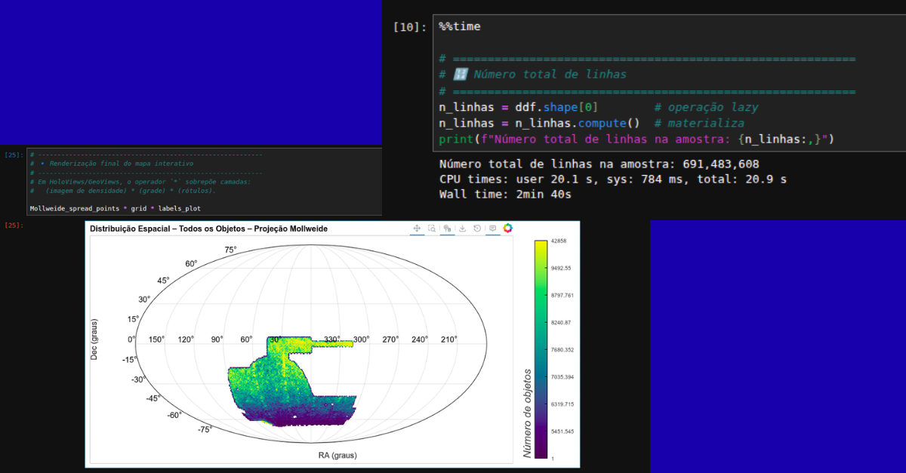
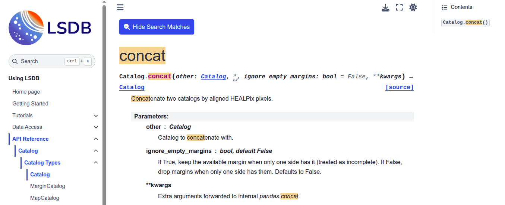

# Hi, I'm Luigi 👋

I'm a **Data Engineer and Data Scientist** specializing in large-scale data processing, distributed computing, and Python-based data pipelines.

I currently work at [LIneA](https://github.com/linea-it), where I design and develop scalable workflows for massive scientific datasets. My work involves data ingestion, transformation, validation, quality assurance, spatial processing, crossmatching, deduplication, and distributed execution across interactive Jupyter environments and multi-node HPC clusters.

I work primarily with **Python, Dask, SLURM, and HPC systems**, with a strong focus on performance, memory efficiency, data quality, reproducibility, testing, and maintainable software.

I currently apply this expertise to large-scale astronomy, including projects connected to the Rubin Observatory / LSST ecosystem and international scientific collaborations.

## What I work on

- Designing scalable Python data pipelines
- Processing datasets ranging from millions to hundreds of millions of records
- Building distributed workflows with Dask and SLURM
- Integrating and standardizing heterogeneous data sources
- Developing data validation, quality assurance, and deduplication workflows
- Building Python packages, command-line tools, automated tests, and CI workflows
- Contributing to open-source scientific software

## Selected work

### [hipscatalog-gen](https://github.com/linea-it/hipscatalog_gen)

A distributed Python pipeline for generating large-scale HiPS catalogs using Dask, LSDB, and HPC infrastructure.

The project supports configurable selection strategies, YAML-based configuration, command-line execution, parallel processing, and reproducible large-scale catalog generation. It is also published on [PyPI](https://pypi.org/project/hipscatalog-gen/).

---

### [Distributed Data Integration and Deduplication Pipeline](https://github.com/linea-it/pzserver_combine_redshift_dedup)

A distributed pipeline for integrating dozens of heterogeneous datasets into consolidated data products.

The workflow includes schema harmonization, quality metadata standardization, scalable spatial crossmatching, deterministic deduplication, distributed validation, and memory-efficient processing with Python, Dask, LSDB, HATS, and HPC infrastructure.

---

### [Interactive Analysis of 691 Million Records with Dask and HPC](https://github.com/linea-it/jupyterhub-tutorial/blob/main/minicurso/minicurso-HPC-2025/curso_hpc.ipynb)

A distributed workflow for interactive analysis and visualization of datasets containing up to **691 million records**.

  

The architecture integrates JupyterLab with a multi-node HPC cluster using Dask and SLURMCluster, combining distributed computation with HoloViews, Bokeh, and Datashader for responsive large-scale data exploration.

I also taught a short course on this workflow and published the training materials openly.

---

### [Open-Source Contribution to LSDB: Distributed Catalog Concatenation](https://docs.lsdb.io/en/latest/reference/api/lsdb.catalog.Catalog.concat.html)

Designed and implemented the `.concat` API in the open-source [LSDB](https://github.com/astronomy-commons/lsdb) library, enabling concatenation of distributed catalogs stored in the HATS format.

  

The contribution included feature design, implementation, integration with the existing catalog architecture, edge-case handling, and development of the complete unit-test suite to validate correctness and reliability.

## Technologies

**Data Engineering & Programming**  
Python · SQL · Pandas · Parquet · Data Pipelines · Data Quality

**Distributed Computing & HPC**  
Dask · SLURM · Distributed Computing · Parallel Computing · HPC

**Scientific Data & Analysis**  
Jupyter · LSDB · HATS · HoloViews · Bokeh · Datashader

**Software Engineering**  
Git · GitHub · Testing · CI · CLI Development · Configuration-Driven Workflows

## Currently expanding my expertise

I'm currently expanding my data engineering background through formal studies in:

- Database systems and SQL
- Data modeling
- Data warehousing
- Cloud data engineering
- AWS

This complements my professional experience with large-scale and distributed data processing.

## Connect with me

- [LinkedIn](https://www.linkedin.com/in/luigi-lucas-d-a8b987156)
- [PyPI](https://pypi.org/user/luigilcsilva/)
